# weddingProjectWebAppScript

## 概要
* 同僚の結婚式の余興で実施した『全員参加型メッセージ送信ゲーム』のクライアント側Webアプリです
* ゲームを動作させるためには本Webアプリの他に、ゲーム本体の環境構築が必要です

### ゲーム本体＠Unity
* ゲーム本体はUnityで作成しています
* ゲーム本体については以下を参照してください
  * _ページ準備中_

## 事前準備
* ニフクラ mobile backend (以下 mBaaS) の会員登録（無料）
  * http://mb.cloud.nifty.com/

## 動作手順
### 手順
#### 1. プロジェクトのダウンロード
* 下記リンクをクリックしてローカルに zip ファイルをダウンロードします
  * https://github.com/natsumo/WeddingProjectWebApp/archive/master.zip
* zip ファイルは解凍しておきます

#### 2. mBaaS にアプリを作成
* mBaaS にログインします
  * https://console.mb.cloud.nifty.com/

* アプリの新規作成をします
  * 既に他のアプリを作成済みの場合は、左上の「+新しいアプリ」をクリックします

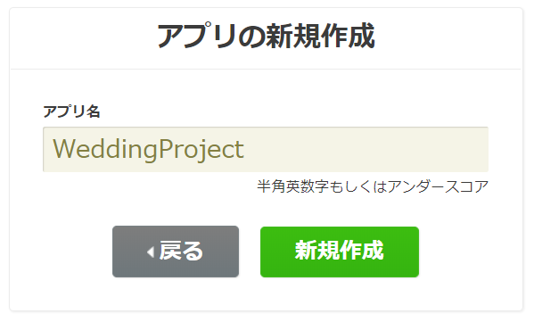<br><br>

* APIキー が発行されます

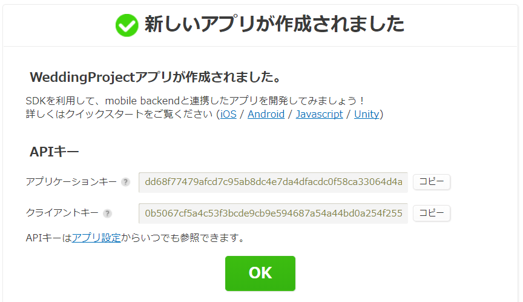<br><br>

* 後ほど使用しますので、ここは「OK」をクリックして閉じます
* 閉じるとダッシュボード（管理画面）が表示されます

#### 3. プロジェクトファイルの編集
* 先ほどダウンロードし、解凍しておいたフォルダを開きます

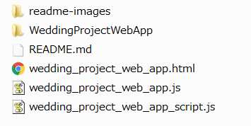<br><br>

* mBaaS を利用するため、以下の ファイルを編集します
  * `wedding_project_web_app.js`
  * `wedding_project_web_app_script.js`
  * `wedding_project_web_app.html`

* `wedding_project_web_app.js` と `wedding_project_web_app_script.js` に mBaaS でアプリを作成した際に生成された APIキー を設定します

```js
// API KEY
var applicationKey = "YOUR_NCMB_APPLICATION_KEY";
var clientKey      = "YOUR_NCMB_CLIENT_KEY";
```

* APIキー は、mBaaS ダッシュボードの右上「アプリ設定」から確認できます

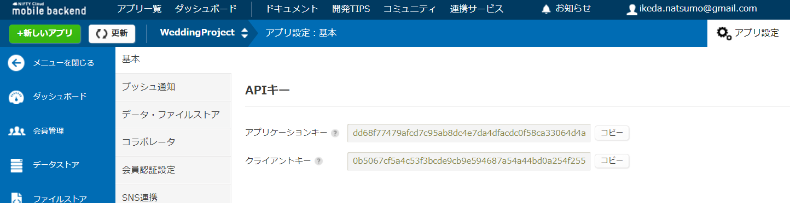<br><br>

* `YOUR_NCMB_APPLICATION_KEY` と `YOUR_NCMB_CLIENT_KEY` を「アプリケーションキー」と「クライアントキー」にそれぞれ書き換えてください

* 書き換えたら保存します
* 次に、`wedding_project_web_app.html`を編集します（10行目）

```html
<!-- Open File URL -->
<meta property="og:url" content="https://mb.api.cloud.nifty.com/2013-09-01/applications/YOUR_NCMB_APPLICATION_ID/publicFiles/" />
```

* `YOUR_NCMB_APPLICATION_ID` の部分を mBaaSのアプリIDに書き換えます
* アプリIDは mBaaS ダッシュボードのURLに記載しています
* 例では `**********` としている箇所がアプリIDです

```txt
例）
https://console.mb.cloud.nifty.com/#/applications/**********/
```

* 書き換えたら保存します

#### 3. ファイルのアップロード
* 編集したファイルを含む「WeddingProjectWebApp」フォルダ内のファイルをすべて以下の手順で mBaaS にアップロードします
* ダッシュボードから「ファイルストア」を開き、「↑アップロード」ボタンをクリックします

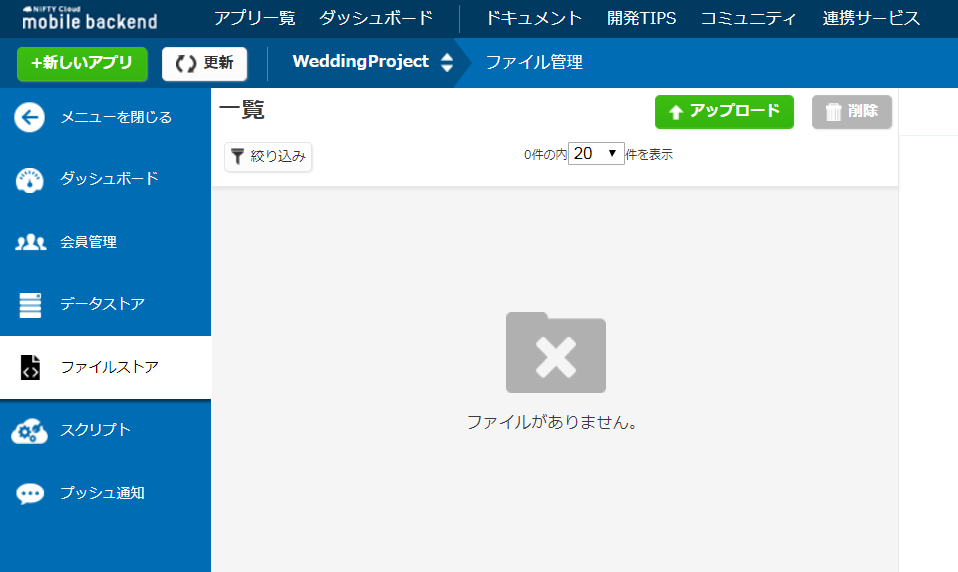<br><br>

* ドラック＆ドロップ、または「ファイルを選択する」ボタンをクリックして「WeddingProjectWebApp」フォルダ内のファイルをすべて選択します

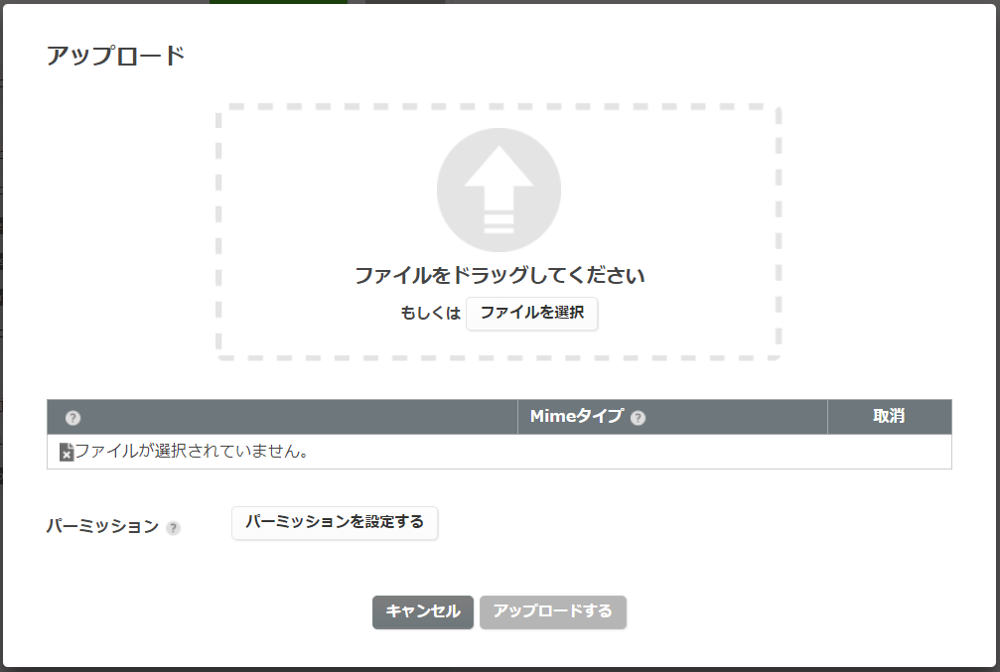<br><br>

* 選択すると以下のようになります
* 問題なければ「アップロードする」ボタンをクリックします

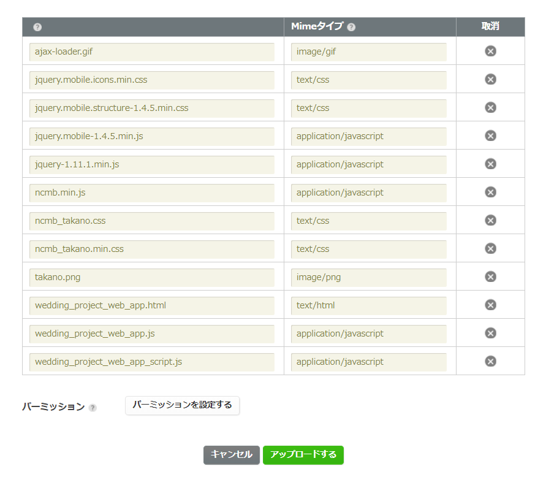<br><br>

* アップロードが無事完了すると図のように表示されます

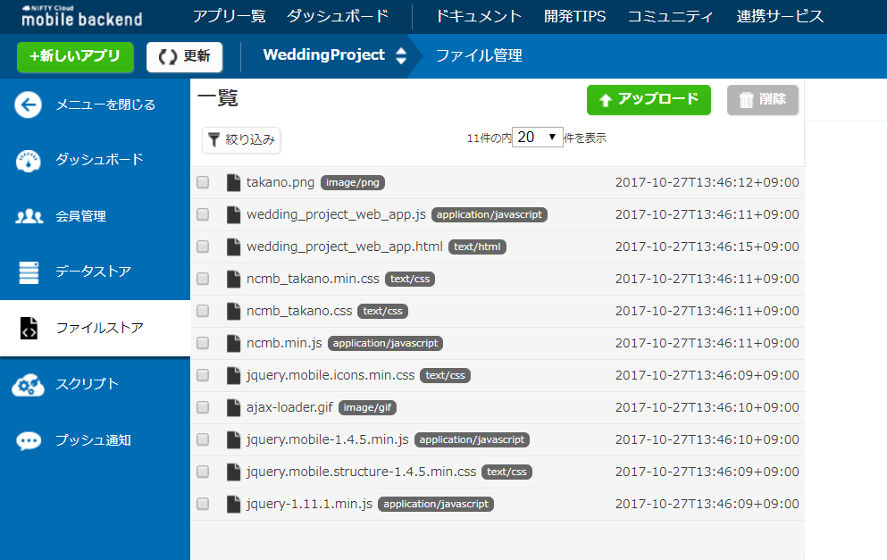<br><br>


#### 4. 公開ファイル許可設定
* ダッシュボード右上の「アプリ設定」から、「データ・ファイルストア」の「公開ファイル設定」を「有効」に設定し、「保存する」をクリックします

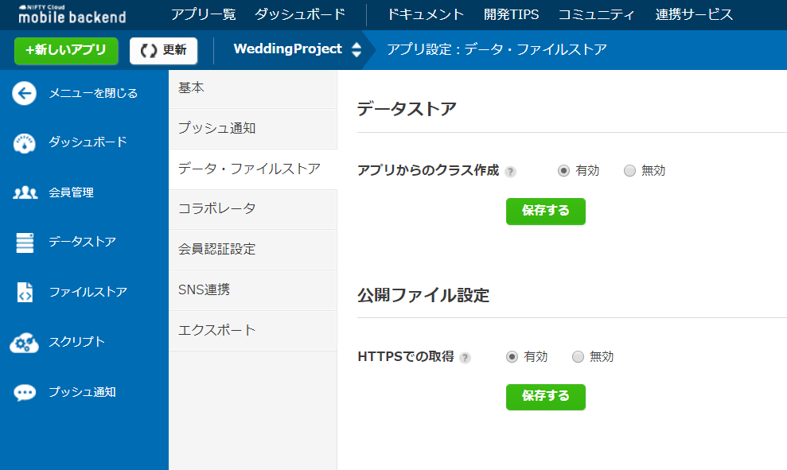<br><br>

#### 5. Webアプリを起動する
* ダッシュボードから「ファイルストア」を開き、`wedding_project_web_app.html` をクリックします
* 「公開ファイルURL」にURLが作成されていますので、クリックします

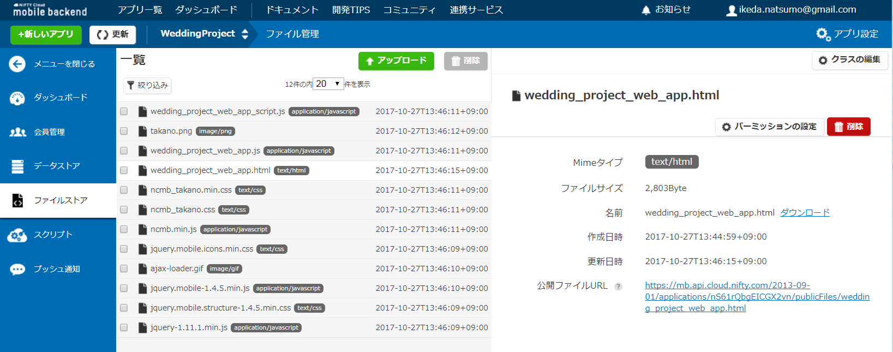<br><br>

* アプリが起動しました

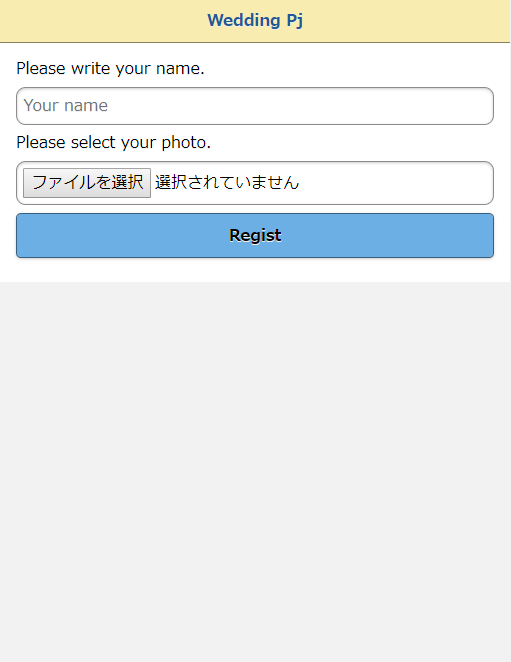<br><br>
