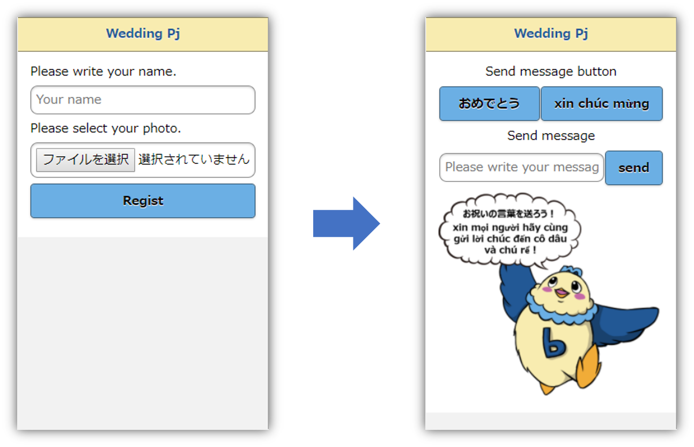
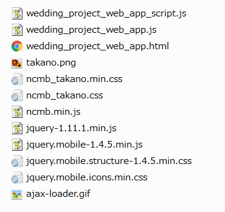
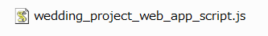
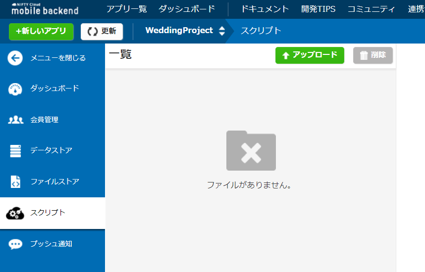
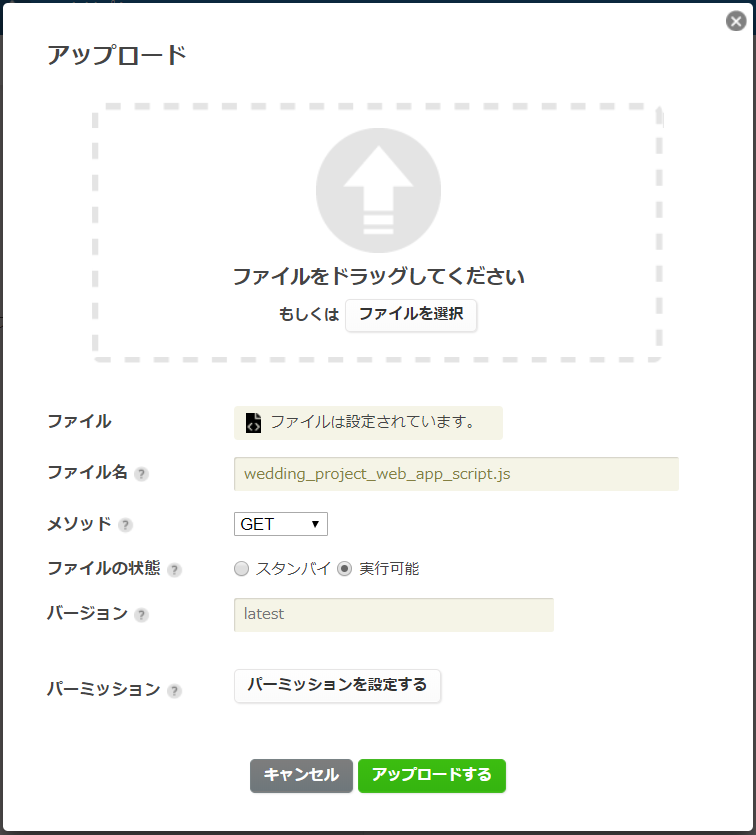
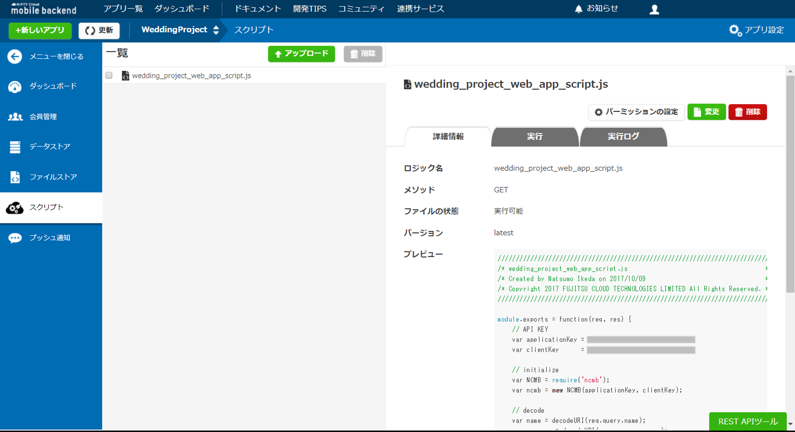
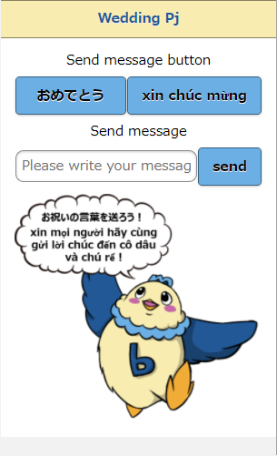

# 『全員参加！メッセージ送信ゲーム』Webアプリ

<br><br>

## 概要
* 同僚の披露宴の余興で実施した『全員参加！メッセージ送信ゲーム』のクライアント側Webアプリです
* ゲームを動作させるためには本Webアプリの準備の他、「ゲーム本体【Unity】」の環境構築が必要です
* 「ゲーム本体【Unity】」については以下を参照してください
  * _ページ準備中_

## 『全員参加！メッセージ送信ゲーム』とは？

<br><br>

* 『全員参加！メッセージ送信ゲーム』は100人超の披露宴参加者全員参加で遊べるお祝いゲームです
* 各自所有しているスマートフォンから指定URLにアクセスすることで誰でも参加できます
* URLにアクセスしたら「名前」と「自撮り画像」を登録します
* ゲームが開始されたら新郎新婦へのお祝いのメッセージを送ります
* お祝いメッセージが登録されると、ゲーム本体に写真付きメッセージが表示されていきます
* お祝いメッセージがいっぱいになると…何かが起こる！？

## 『全員参加！メッセージ送信ゲーム』Webアプリ事前準備
* ニフクラ mobile backend (以下 mBaaS) の会員登録（無料）
  * http://mb.cloud.nifty.com/

## 動作までの手順
### 1. プロジェクトのダウンロード
* 下記リンクをクリックしてローカルに zip ファイルをダウンロードします
  * https://github.com/natsumo/WeddingProjectWebApp/archive/master.zip
* zip ファイルは解凍しておきます

### 2. mBaaS にアプリを作成
* mBaaS にログインします
  * https://console.mb.cloud.nifty.com/

* アプリの新規作成をします
  * 既に他のアプリを作成済みの場合は、左上の「+新しいアプリ」をクリックします

<br>

* APIキー が発行されます

<br><br>

* 後ほど使用しますので、ここは「OK」をクリックして閉じます
* 閉じるとダッシュボード（管理画面）が表示されます

### 3. プロジェクトファイルの編集
* 先ほどダウンロードし、解凍しておいたフォルダを開きます

<br><br>

* mBaaS を利用するため、以下の ファイルを編集します
  * `WeddingProjectWebApp` フォルダ内
    * `wedding_project_web_app.js`
    * `wedding_project_web_app.html`

    <br><br>

  * `wedding_project_web_app_script` フォルダ内
    * `wedding_project_web_app_script.js`

    <br><br>

* `wedding_project_web_app.js` と `wedding_project_web_app_script.js` に mBaaS でアプリを作成した際に生成された APIキー を設定します

```js
// API KEY
var applicationKey = "YOUR_NCMB_APPLICATION_KEY";
var clientKey      = "YOUR_NCMB_CLIENT_KEY";
```

* APIキー は、mBaaS ダッシュボードの右上「アプリ設定」から確認できます

<br><br>

* `YOUR_NCMB_APPLICATION_KEY` と `YOUR_NCMB_CLIENT_KEY` を「アプリケーションキー」と「クライアントキー」にそれぞれ書き換えてください

* 書き換えたら保存します
* 次に、`wedding_project_web_app.html`を編集します（10行目）

```html
<!-- Open File URL -->
<meta property="og:url" content="https://mb.api.cloud.nifty.com/2013-09-01/applications/YOUR_NCMB_APPLICATION_ID/publicFiles/" />
```

* `YOUR_NCMB_APPLICATION_ID` の部分を mBaaSのアプリIDに書き換えます
* アプリIDは mBaaS ダッシュボードのURLに記載しています
* 例では `**********` としている箇所がアプリIDです

```txt
例）
https://console.mb.cloud.nifty.com/#/applications/**********/
```

* 書き換えたら保存します

### 3. ファイルのアップロード
* 編集したファイルを含む以下のファイルをそれぞれ mBaaS の ファイルストア 、スクリプト にアップロードします
  * `WeddingProjectWebApp` フォルダ内のすべてのファイル（11ファイル）<br>⇒ 「ファイルストア」へ
  * `wedding_project_web_app_script` フォルダ内のファイル（1ファイル）<br>⇒ 「スクリプト」へ

#### 「ファイルストア」へのアップロード
* ダッシュボードから「ファイルストア」を開き、「↑アップロード」ボタンをクリックします

<br><br>

* ドラック＆ドロップ、または「ファイルを選択する」ボタンをクリックして「WeddingProjectWebApp」フォルダ内のファイル（11ファイル）をすべて選択します

<br><br>

* 選択すると以下のようになります

<br><br>

* 問題なければ「アップロードする」ボタンをクリックします
* アップロードが無事完了すると図のように表示されます

<br><br>

#### 「スクリプト」へのアップロード
* 同じくダッシュボードから「スクリプト」を開き、「↑アップロード」ボタンをクリックします
<br><br>

* ドラック＆ドロップ、または「ファイルを選択する」ボタンをクリックして「wedding_project_web_app_script」フォルダ内のファイル（1ファイル）を選択します

<br><br>

* 選択すると設定項目が表示されますので以下のように設定します
  * メソッド：「GET」
  * ファイルの状態：「実行可能」
  * 上記以外の設定は任意
* 問題なければ「アップロードする」ボタンをクリックします
* アップロードが無事完了すると図のように表示されます

<br><br>

### 4. 公開ファイル許可設定
* ダッシュボード右上の「アプリ設定」から、「データ・ファイルストア」の「公開ファイル設定」を「有効」に設定し、「保存する」をクリックします

<br><br>

### 5. Webアプリを起動する
* ダッシュボードから「ファイルストア」を開き、`wedding_project_web_app.html` をクリックします
* 「公開ファイルURL」にURLが作成されていますので、クリックします

<br><br>

* Webアプリが起動します

<br><br>

* このURLを披露宴の参加者に配ることでゲームに参加できます

## 遊び方 ～参加方法～
* URLにアクセスして、名前の入力と写真ファイルの選択をします
* 「Regist」ボタンを押します

<br><br>

* ゲームが開始したら、お祝いメッセージを送ります
* 「おめでとう」ボタン（ベトナム語あり）または、自由記述でメッセージを送ることができます

<br><br>

## 解説
* 最初に登録する名前と自撮り画像のデータとお祝いメッセージのデータはすべて mBaaS に保存されます
* mBaaS に保存することでオンライン化され、ゲーム本体【Unity】からデータを使用できるようになります

### 自撮り画像の保存
* 画像データは、 __ファイルストア__ に保存しています
* ファイル名（`photoName`）とファイルデータ（`photoData`）を引数に設定することで保存ができます
  * `WeddingProjectWebApp/wedding_project_web_app.js` 131行目参照

```js
ncmb.File.upload(photoName, photoData)
    .then(function(res){
        // アップロード成功時の処理

    })
    .catch(function(err){
        // アップロード失敗時の処理

    });
```

### お祝いメッセージの保存（同時接続制御）
* 文字データは、 __データストア__ に保存しています
* ただ保存するのではなく、100人超参加者が __同時アクセス__ 可能なように __スクリプト__ 機能を利用しています
* Webアプリ側ではスクリプトを呼び出します
  * `WeddingProjectWebApp/wedding_project_web_app.js` 189行目参照

```js
ncmb.Script
    .query({"name": enc_name, "message": enc_message, "photoName": enc_photoName})
    .exec("GET", "wedding_project_web_app_script.js")
    .then(function(res){
        // 実行成功時の処理

    })
    .catch(function(error){
        // 実行失敗時の処理

    });
```

* スクリプト側で保存を実行します
  * `WeddingProjectWebApp_Script/wedding_project_web_app_script.js` 22行目参照

```js
var Congratulation = ncmb.DataStore('Congratulation');
var congratulation = new Congratulation();
congratulation.set("name", name)
              .set("message", message)
              .set("photoName", photoName)
              .save()
              .then(function(result){
                  // success
                  res.send(result);
              })
              .catch(function(error){
                  // failure
                  res.send(error);
              });
```

### Unityとの連携イメージ
* Webアプリから mBaaS に保存されたデータは ゲーム本体【Unity】で使用されます
* お祝いメッセージが mBaaS に保存されたことを感知し、データを取得してゲームを進める仕組みです
* 詳細は ゲーム本体【Unity】の解説ページ を参照ください
  *  _ページ準備中_

## 参考
* このゲームは余興などのあくまで __一時__ 楽しむゲームであるため、APIキーは丸見えの状態で使用しています。。継続して使用する場合は考慮する必要があります。
